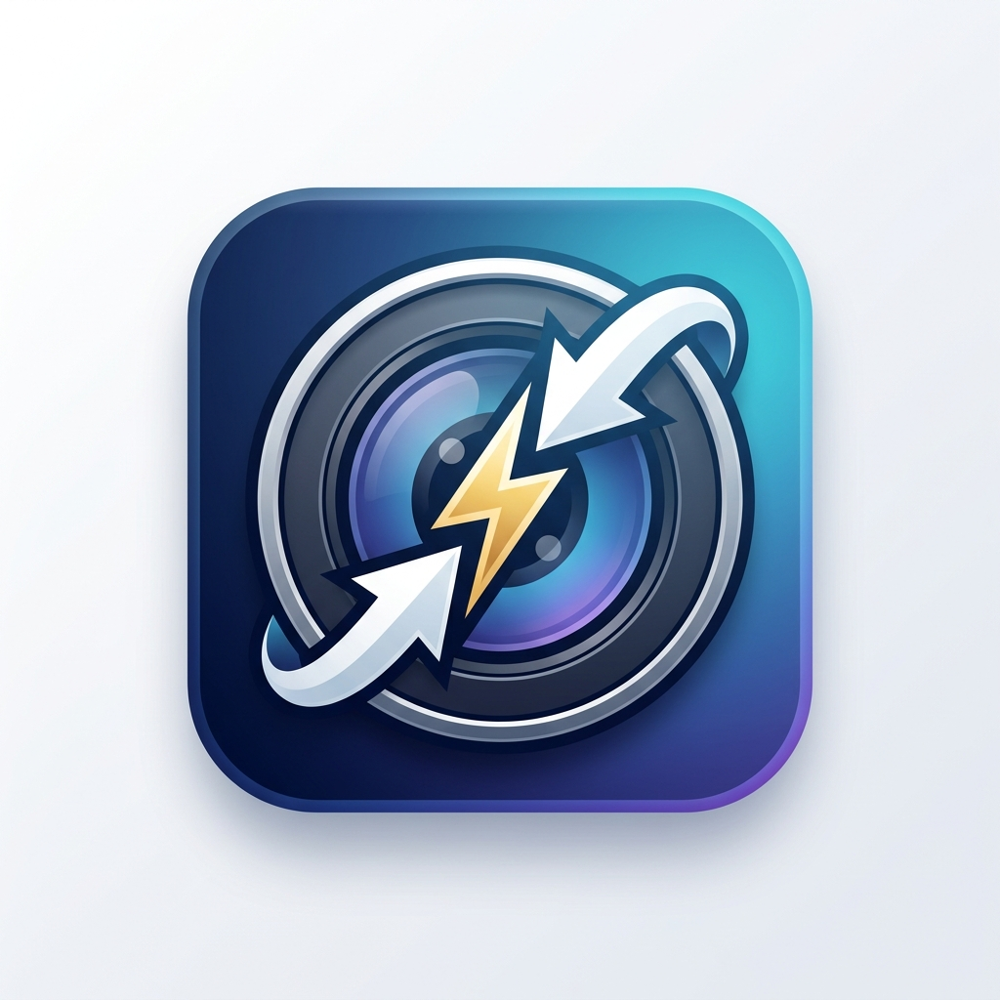

<div align="center">
  
  
  # Optimizador de Fotos - DanyTechCo
  
  **La herramienta definitiva para optimizar, comprimir y añadir marcas de agua a tus imágenes masivamente.**

  [](https://github.com/danycabarcas/Fotos-color/releases/latest)
  [](#)
  [](#)
  
  [**🌐 Visitar Página Web Oficial**](https://danycabarcas.github.io/Fotos-color)
</div>

---

## 📸 ¿Qué es el Optimizador de Fotos?
Es una aplicación de escritorio moderna diseñada para fotógrafos, diseñadores y usuarios en general que necesitan procesar cientos de imágenes en cuestión de segundos. Sin comandos complicados, todo desde una interfaz gráfica (GUI) limpia y fácil de usar.

## ✨ Características Principales
* ⚡ **Procesamiento Masivo:** Optimiza carpetas enteras de fotos en un par de clics.
* 🛡️ **Marca de Agua Dinámica:** Añade tu logo (formato PNG) automáticamente a todas las fotos. Puedes ajustar la posición y su opacidad para que luzca perfecto.
* 🎛️ **Control de Calidad:** Define el peso máximo que deseas por foto (ej. 1MB), el ancho/alto máximo, y el programa calculará la compresión ideal sin sacrificar calidad visual.
* 🔄 **Autoguardado Seguro:** Nunca sobrescribe tus fotos originales. Crea una carpeta de destino con tus fotos listas para enviar.
* 🔔 **Actualizaciones Inteligentes:** La aplicación te avisará automáticamente cuando haya una nueva versión disponible.

---

## 📥 ¿Cómo Descargar (Para Usuarios Finales)?
Si solo quieres utilizar la aplicación, no necesitas descargar el código.
1. Ve a la sección **[Releases](https://github.com/danycabarcas/Fotos-color/releases/latest)** de este repositorio.
2. Descarga el archivo **`Instalador_Optimizador_Fotos.exe`**.
3. Ejecútalo, dale a "Siguiente" y ¡listo! Tendrás un acceso directo en tu escritorio.

---

## 💻 Para Desarrolladores (Cómo compilar)
Si quieres modificar el código fuente de la aplicación, este proyecto está construido con Python y la interfaz gráfica usa `customtkinter`.

### Requisitos
* Python 3.10 o superior.
* Inno Setup (Para crear el instalador final).

### Instalación local
```bash
# 1. Clona el repositorio
git clone https://github.com/danycabarcas/Fotos-color.git

# 2. Instala las dependencias
pip install customtkinter Pillow pyinstaller

# 3. Ejecuta la aplicación en modo desarrollo
python main_app.py
```

### Compilar el Ejecutable (.exe)
Hemos incluido un script automático para PyInstaller.
```bash
python build.py
```
El archivo `.exe` se generará dentro de la carpeta `dist/Optimizador_de_Fotos/`.

---

## 👨‍💻 Autor
Desarrollado con pasión por **Daniel Cabarcas** (DanyTechCo)
* 💼 LinkedIn: [Daniel Cabarcas](https://www.linkedin.com/in/daniel-cabarcas/)
* 📧 Correo: Danycabarcas@gmail.com
